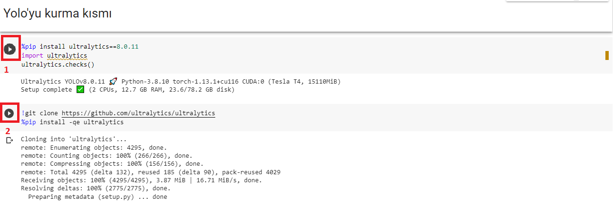
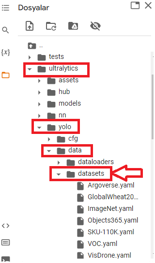
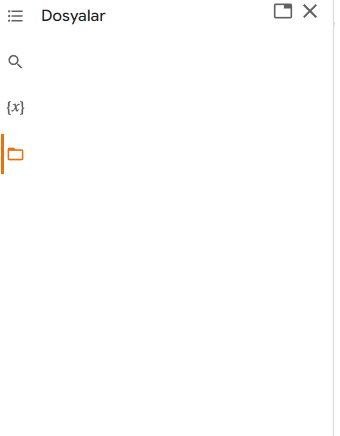
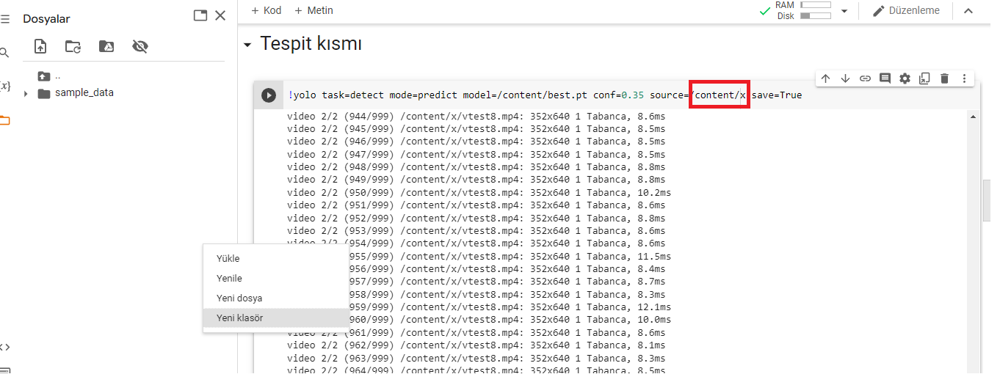

# Pistol-Detection-YoloV8
 
#### Yolov8 kullanarak kendi verisetimizle eğitebileceğimiz tabanca tespiti yapabilen model oluşturma.
- Yolov8'de kendi verisetimiz ile eğitebilir ve tespitlerde kendi eğittiğiniz modeli kullanabilirsiniz.
- Verisetiyle önceden eğitilmiş model ile tespitleri yapabilirsiniz.

## Eğitim kısmı
1. İlk olarak Pistol_Datasets dosyasını zipleyin.
2. YOLOv8_tabanca_tespiti.ipynb, customized.yaml ve Pistol_Datasets.zip'i Google Drive'nize yükleyin.
3. Drive'de YOLOv8_tabanca_tespiti.ipynb'i açın ve aşağıdaki fotoğraftaki kodları sırayla çalıştırın.

4. ultralytics>ultralytics>yolo>data>datasets buraya yaml dosyasını atıyoruz.

5. Google Drive'mizi yükleme kısmındaki kodu çalıştırın ve daha sonra Drive'deki datasetini yükleme kısmındaki kodu çalıştırın.
6. Model eğitim kısmını istediğiniz epoch değerinde eğitime başlayın.(Tavsiyem epoch değerini 40 veya 50 yapın ve bu eğitim kısmı biraz uzun sürer bilginiz olsun.
Eğitim bittikten sonra model DOSYALAR kısmında runs/detect/train/weights/best.pt konumuna kaydedilir (best.pt) modelimizdir.
7. Tespit kısmına geldiğimizde bu repositoryden indirdiğiniz test dosyasına isterseniz ek video ve fotoğraf ekleyip veya direkt sadece bu verileri kullanarak tespiti yapabilirsiniz.Test dosyasındaki tüm fotoğraf ve videoları tutup dosyalar kısmındaki boşluğa atın ve tamamiyle yüklenmesini bekleyin.

8. Fotoğraflar ve videolar yüklendikten sonra dosyalar kısmında boşluğa gelip sağ tıkla yeni klasör oluşturun ve yüklenen fotoğraf ve videoları bu klasöre atın.

9. Yukarıdaki kırmızı alana /content/oluşturduğunuz_klasör_adı ve kodu çalıştırın.Kod çalışması bittikten sonra veriler runs/detect/predict kısmına kayıt olur.
10.runs/detect/predict kısmına girip istediğiniz videoya veya fotoğrafa gelip sağ tıklayın ve yolunu kopyalayın.Aşağıdaki resimde gördüğünüz üzere kopyaladığınız yolu yapıştırın ve kodu çalıştırın.(Eğer video ise her video kodunu çalıştırdığınızda bir sonraki videoyu görmek için dosyalar kısmındaki "result_compressed.mp4"ü silin ve video kodunu çalıştırın.)
 
# Hepsi bu kadar
